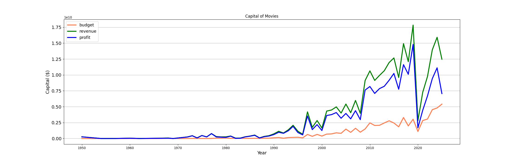
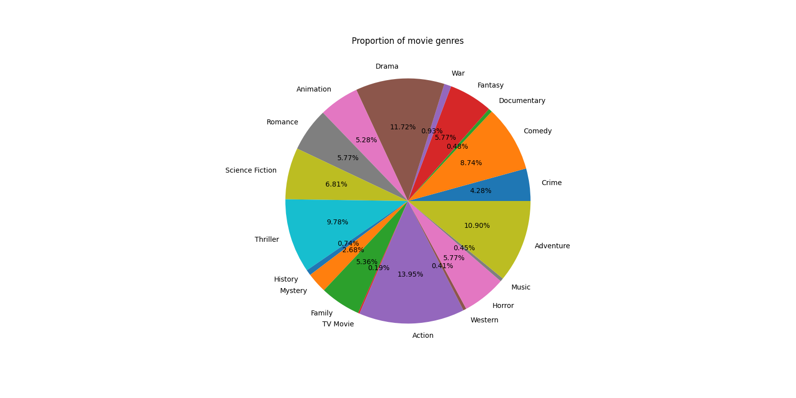
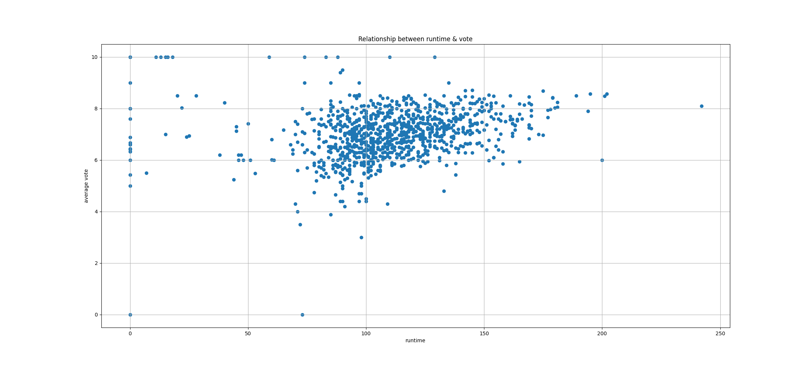
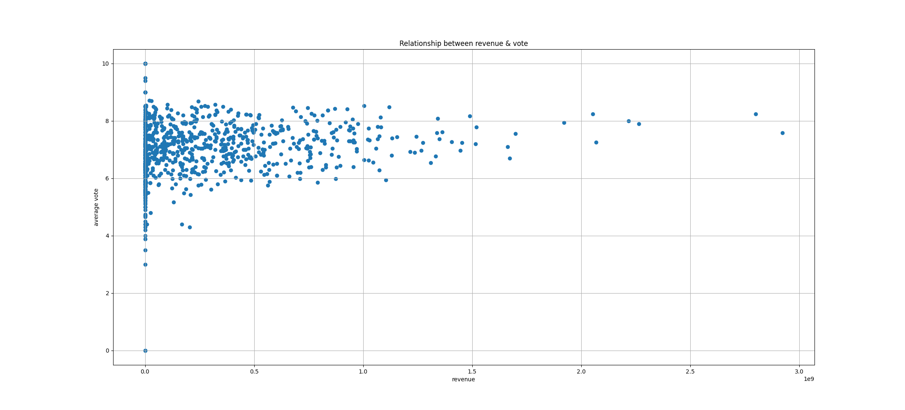
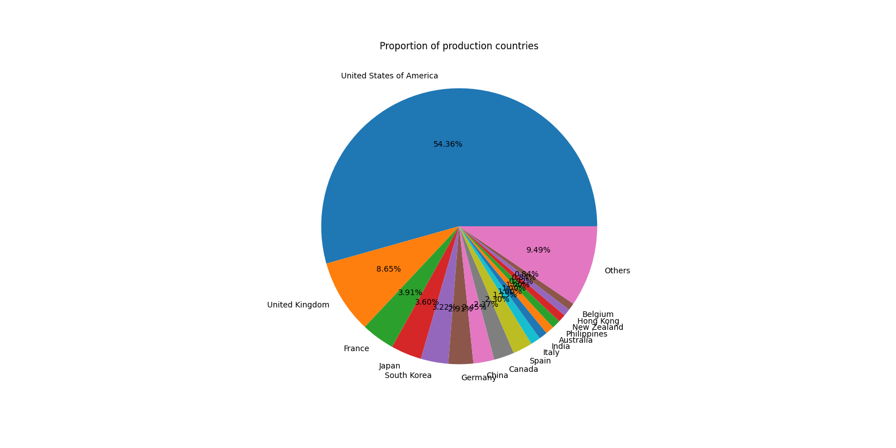

# Movie Data Analysis Pipeline

This project offers a comprehensive solution for collecting, cleaning, processing, and analyzing movie data from The Movie Database (TMDB) API. Whether you're a data enthusiast, film researcher, or developer, this pipeline helps you uncover insights from thousands of movies with ease.

## Features

* Collects movie data from TMDB using their public API
* Cleans and filters raw data
* Processes data to compute profit and extract release year
* Generates visualizations and a PDF report

## Requirements

* Python 3.7+
* TMDB API Key

## Installation

1. Clone the repository:

   ```bash
   git clone https://github.com/yourusername/movie-data-analysis.git
   cd movie-data-analysis
   ```

2. Create a virtual environment and activate it:

   ```bash
   python -m venv venv
   source venv/bin/activate  # On Windows: venv\\Scripts\\activate
   ```

3. Install dependencies:

   ```bash
   pip install -r requirements.txt
   ```

4. Create a `.env` file in the root directory and add your TMDB API key:

   ```env
   TMDB_API_KEY=your_api_key_here
   ```

## Usage

Run the pipeline with default settings (collect 500 pages):

```bash
python pipeline.py
```

Or specify the number of pages to collect:

```bash
python pipeline.py --pages 50
```

## Output Files

* `movie_dataset_raw.csv`: Raw data collected from TMDB
* `movie_dataset_cleaned.csv`: Cleaned data
* `processed_movies.csv`: Processed data with additional fields
* `movie_analysis_report.pdf`: PDF report with visualizations
* PNG files for each chart

## Sample Visualizations

Here are some example charts generated by the pipeline:

### Movies Released Per Year


### Capital of Movies



### Proportion of Movie Genres



### Runtime vs Vote



### Revenue vs Vote



### Production Countries



## Notes

* The `.env` file is excluded from version control via `.gitignore`
* Make sure your API key is valid and has access to the TMDB endpoints
