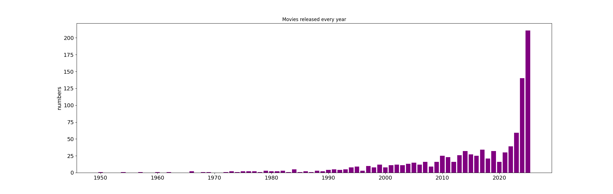

# Movie Data Analysis Pipeline


A comprehensive data pipeline for collecting, cleaning, analyzing, and visualizing movie data from The Movie Database (TMDB). This project provides a full suite of tools to turn raw movie data into actionable insights, complete with an interactive dashboard for exploration.

## 🚀 Features

*   **Automated Data Collection**: Fetches movie data from the TMDB API.
*   **Data Cleaning & Processing**: Handles missing values, filters irrelevant data, and enriches the dataset with calculated fields like `profit` and `release_year`.
*   **In-depth Analysis**: Generates a variety of analyses, including trends over time, genre and country distributions, and correlations between different metrics.
*   **Static Visualizations**: Creates a PDF report with a collection of charts for a quick overview of the findings.
*   **Interactive Dashboard**: A web-based dashboard built with Dash and Plotly that allows for interactive exploration of the data with filters for year, genre, and country.

## 🏁 Getting Started

Follow these steps to get the project up and running on your local machine.

### Prerequisites

*   Python 3.7 or higher
*   A TMDB API Key

### Installation

1.  **Clone the repository:**
    ```bash
    git clone https://github.com/monodara/movie-data-analysis.git
    cd movie-data-analysis
    ```

2.  **Set up a virtual environment:**
    ```bash
    python -m venv venv
    source venv/bin/activate  # On Windows use `venv\Scripts\activate`
    ```

3.  **Install the dependencies:**
    ```bash
    pip install -r requirements.txt
    ```

4.  **Configure your API key:**
    Create a `.env` file in the root of the project and add your TMDB API key like so:
    ```env
    TMDB_API_KEY=your_api_key_here
    ```

## Usage

This project has two main components: the data pipeline and the interactive dashboard.

### 1. Run the Data Pipeline

The pipeline collects, cleans, and processes the data, and generates a PDF report.

To run the pipeline with the default setting of collecting 500 pages of data:
```bash
python pipeline.py
```

You can also specify the number of pages to collect:
```bash
python pipeline.py --pages 50
```

This will produce the following output files:
*   `movie_dataset_raw.csv`
*   `movie_dataset_cleaned.csv`
*   `processed_movies.csv`
*   `movie_analysis_report.pdf`
*   Several `.png` image files for the charts.

### 2. Launch the Interactive Dashboard

Once you have the `processed_movies.csv` file, you can launch the interactive dashboard:

```bash
python dashboard.py
```

Then, open your web browser and navigate to `http://127.0.0.1:8050/`.


## 📊 Sample Visualizations

Here are some of the charts generated by the analysis pipeline:

### Movies Released Per Year


### Capital of Movies


### Proportion of Movie Genres


### Runtime vs Vote


### Revenue vs Vote


### Production Countries


